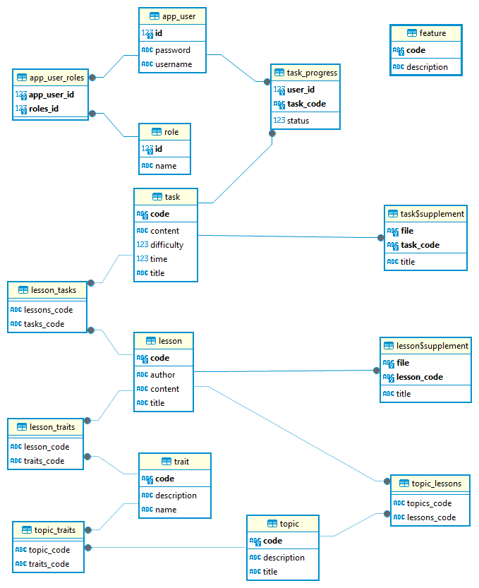

# Структура БД

На данной картинке представлена схема БД

# Описание
## Пользователи и роли
### app_user
- id: integer - уникальный идентификатор пользователя;
- password: text - зашифрованный пароль пользователя;
- username: text - логин пользователя;
### role
- id: integer - уникальный идентификатор роли;
- name: text - название роли;
### app_user_roles
- app_user_id: integer - идентификатор пользователя;
- roles_id: integer - идентфикатор пользователя;

Данная таблица разбивает отношение **многие ко многим** между пользователями и его ролями

## Задания
### task
- code: text - уникальный код задания;
- content: text - ссылка на **markdown** файл
- difficulty: integer - сложность задания;
- time: integer - время в минутах, отведенное на выполнение задания;
- title: text - заголовок задания;
### task_progress
- user_id: integer - идентификатор пользователя;
- task_code: text - код задания;
- status: integer - статус выполнения задания конкретным пользователем;
### task_supplement
- file: text - ссылка на файл приложения;
- task_code: text - код задания;
- title: text - заголовок приложения;

## Учебные материалы
### lesson
- code: text - уникальный код учебного материала;
- author: text - автор учебного материала;
- content: text - ссылка на **markdown** файл с содержанием учебного материала;
- title: text - заголовок учебного материала;
### lesson_tasks
- lessons_code: text - код учебного материала;
- tasks_code: text - код задания;
### lesson_supplement
- file: text - ссылка файл приложения;
- lesson_code: text - код учебного материала;
- title: text - заголовок приложения;

## Теги
### trait
- code: text - код тега;
- description: text - описание тега;
- name: text - название тега;
### lesson_traits
- lesson_code - код задания;
- traits_code - код тега;

## Темы
### topic
- code: text - код темы;
- description: text - описание темы;
- title: text - заголовок темы;
### topic_traits
- topic_code: text - код темы;
- traits_code: text - код тега;
### topic_lessons
- topics_code: text - код темы;
- lessons_code: text - код учебного материала;
